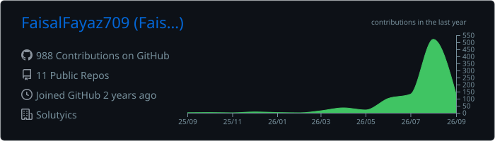
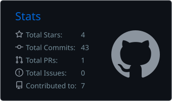
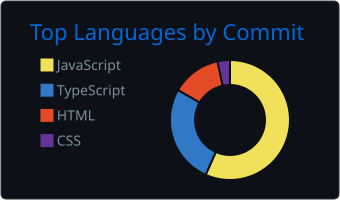

<div align="center">

<h1>Hi, I'm Faisal Fayaz 👋
Full Stack Engineer<h1/>

<a href="https://git.io/typing-svg">  </a>

<br/>

<p> <a href="https://github.com/FaisalFayaz709">  </a> <a href="https://www.linkedin.com/in/faisal-fayaz-9703183a6/">  </a> <a href="mailto:faisalfayaz825@gmail.com">  </a> </p>

📍 Lahore, Pakistan   •   💻 Full Stack Engineering   •   🚀 Open to Software Engineering Opportunities

</div>

---

## 👨‍💻 About Me

I'm a **Full Stack Engineer** based in Lahore, Pakistan, focused on building reliable and scalable web applications using modern **JavaScript and TypeScript technologies**.

I enjoy working across the complete application stack — from designing databases and backend architecture to building APIs, authentication systems, and responsive frontend experiences.

- 💻 Full Stack development with **React.js, Next.js, NestJS & Node.js**
- ⚡ Building scalable applications with **TypeScript**
- 🗄️ Working with **PostgreSQL, MongoDB & Prisma ORM**
- 🔗 Designing and integrating **RESTful APIs**
- 🔐 Implementing **JWT Authentication & Role-Based Access Control**
- 🐳 Working with **Docker & Docker Compose**
- 🔄 Building **CI/CD pipelines with GitHub Actions**
- 🧠 Interested in **System Design, Clean Architecture & SOLID Principles**
- 🛠️ Experienced in debugging APIs, databases, integrations, and application logic
- 🚀 Focused on writing clean, maintainable, production-ready software

---

## ⚙️ Technology Stack

### 💻 Languages

<p>
  
</p>

**TypeScript • JavaScript • HTML5 • CSS3**

---

### 🎨 Frontend

<p>
  
</p>

**React.js • Next.js • Tailwind CSS • Bootstrap • Responsive Design**

---

### ⚙️ Backend

<p>
  
</p>

**NestJS • Node.js • Express.js • REST APIs • JWT • RBAC**

---

### 🗄️ Database & ORM

<p>
  
</p>

**PostgreSQL • MongoDB • MySQL • Prisma ORM**

---

### 🛠️ DevOps & Tools

<p>
  
</p>

**Docker • Docker Compose • Git • GitHub • GitHub Actions • npm • Swagger / OpenAPI**

---

## 🧠 Engineering Focus

<table>
<tr>
<td><b>Frontend</b></td>
<td>React.js, Next.js, TypeScript, Responsive UI, Component Architecture</td>
</tr>

<tr>
<td><b>Backend</b></td>
<td>NestJS, Node.js, Express.js, REST APIs, Modular Architecture</td>
</tr>

<tr>
<td><b>Database</b></td>
<td>PostgreSQL, MongoDB, Prisma ORM, Schema Design, Data Integrity</td>
</tr>

<tr>
<td><b>Security</b></td>
<td>JWT Authentication, RBAC, Protected APIs, Authorization</td>
</tr>

<tr>
<td><b>DevOps</b></td>
<td>Docker, Docker Compose, GitHub Actions, CI/CD</td>
</tr>

<tr>
<td><b>Architecture</b></td>
<td>Clean Architecture, SOLID Principles, System Design</td>
</tr>
</table>

---

## 📈 GitHub Activity

<div align="center">


</div>

---

## 📊 GitHub Statistics

<div align="center">



<br/>





</div>

---

## 💭 How I Approach Engineering

```ts
const faisal = {
  role: "Full Stack Engineer",

  frontend: [
    "React.js",
    "Next.js",
    "TypeScript",
  ],

  backend: [
    "NestJS",
    "Node.js",
    "Express.js",
  ],

  database: [
    "PostgreSQL",
    "MongoDB",
    "Prisma ORM",
  ],

  engineering: [
    "Clean Architecture",
    "SOLID Principles",
    "System Design",
    "REST API Design",
  ],

  mindset: [
    "Build",
    "Debug",
    "Improve",
    "Ship",
  ],
};

📫 Let's Connect

I'm always interested in connecting with developers, engineering teams, and people building meaningful software.

<div align="center"> <a href="mailto:faisalfayaz825@gmail.com">  </a> <a href="https://github.com/FaisalFayaz709">  </a> </div>
